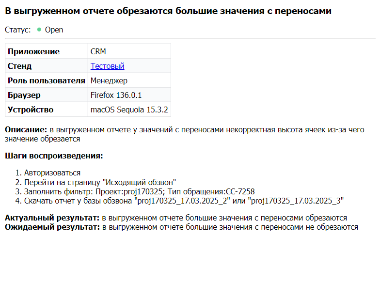

# Телеграм-бот для уведомлений по тикетам YouTrack и JIRA
Данный телеграм-бот уведомляет в ЛС/чате о созданных/закрытых тикетах в YouTrack и JIRA.

## Настройка
В файле `.env` нужно заполнить:
```dotenv
TG_KEY="тг ключ к боту"
YT_IMAGE_URI="RegExp для получения картинки тикета YT (например, ^http:\/\/172\.20\.20\.225:4040\/issue\/[ABC]+-\d+$")
JIRA_IMAGE_URI="RegExp для получения картинки тикета JIRA (аналогично YT)"
YT_URI="URI к YouTrack'у"
YT_TOKEN="Токен авторизации из YouTrack"
JIRA_HOST="HOST JIRA"
JIRA_USERNAME="Логин JIRA"
JIRA_PASSWORD="Пароль JIRA"
```

## Возможности бота
- Посмотреть тикеты с помощью команды `/my_tickets`

Примерный ответ:
```
🟢 Normal Bug AB-8011 Список проектов. Не работает поиск
```
- Посмотреть открытые тикеты юзера `/open_tickets`. После ввода будет выбор пользователя, у которого собираетесь смотреть открытые тикеты.
- Посмотреть все тикеты `/see_tickets`. После ввода будет выбор статуса тикета, которые должны отобразиться.
- Ответное сообщение `/get_img` на сообщение бота содержащее ссылку на тикет. В ответ будет прислана картинка с телом тикета.<br>
**ИЛИ**<br>
Отправить прямую ссылку боту. Он также пришлёт изображение тела тикета.

Пример изображения:


- Посмотреть активных пользователей бота `/get_users`. Вернёт список пользователей, которые пользуются ботом.
- Уведомить всех пользователей бота с помощью `/alert {текст уведомления}`. Разошлёт всем сообщение.